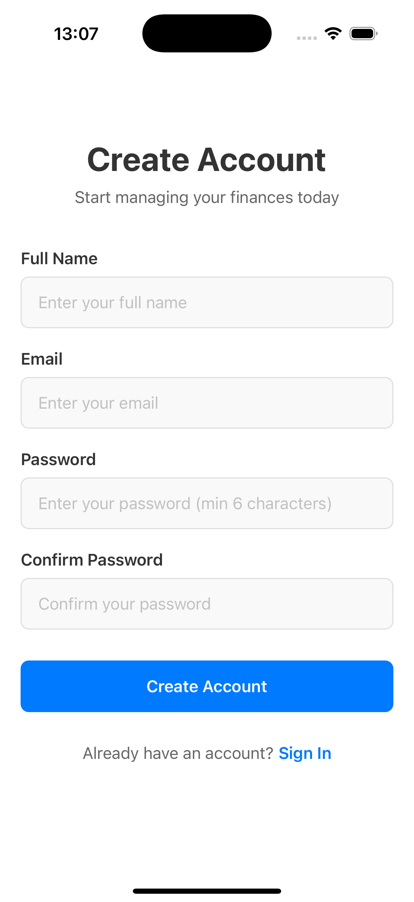

# Money Management App

A modern React Native mobile application for personal finance management, built with Expo and TypeScript.

## 📱 Screenshots

<div align="center">
  
  
  
</div>

## 🚀 Features

- **Secure Authentication**: User registration and login with encrypted password storage
- **Dashboard Overview**: Financial summary with balance, income, and expense tracking
- **Account Management**: Support for multiple bank accounts and wallets
- **Transaction Tracking**: Record and categorize income and expenses
- **Budget Planning**: Set spending limits and track budget progress
- **Data Persistence**: Local database storage with Realm
- **Modern UI**: Clean, intuitive interface with responsive design

## 🛠️ Tech Stack

- **Frontend**: React Native with Expo
- **Language**: TypeScript
- **State Management**: Zustand
- **Database**: Realm (local storage)
- **Security**: Expo SecureStore & Expo Crypto
- **Navigation**: Expo Router
- **Styling**: React Native StyleSheet

## 📱 Architecture

### Authentication Flow

- Protected routes with automatic redirection
- Secure credential storage using device keychain
- Session management with persistent login state

### Database Schema

- **Users**: Profile and account information
- **Accounts**: Bank accounts, credit cards, wallets
- **Categories**: Income and expense categorization
- **Transactions**: Financial transaction records
- **Budgets**: Spending limits and tracking

### State Management

- Centralized auth state with Zustand
- Reactive UI updates based on authentication status
- Clean separation of concerns

## 🚦 Getting Started

### Prerequisites

- Node.js (v16 or higher)
- npm or yarn
- Expo CLI
- iOS Simulator or Android Emulator (or Expo Go app)

### Installation

1. Clone the repository:

   ```bash
   git clone https://github.com/tungnq2606/money-management-app.git
   cd money-management-app
   ```

2. Install dependencies:

   ```bash
   npm install
   ```

3. Start the development server:
   ```bash
   npm start
   ```

## 🧩 Database: Schemas Overview

This app uses Realm for local persistence. Current models:

- User: `id`, `name`, `birthday`, `phoneNumber`, `address`, `email`, `password`, `createdAt`, `updatedAt`
- Wallet: `id`, `userId`, `name`, `type`, `amount`, `toDate`, `fromDate`, `createdAt`, `updateAt`
- Category: `id`, `name`, `userId`, `parentId`, `type (income|expense)`, `createdAt`, `updateAt`
- Transaction: `id`, `walletId`, `categoryId`, `amount`, `type (income|expense)`, `note`, `createdAt`, `updatedAt`
- Budget: `id`, `name`, `walletId[]`, `categoryId`, `amount`, `remain`, `loop`, `toDate`, `fromDate`, `note`, `createdAt`, `updateAt`
- Notification: `_id (objectId)`, `content`, `link`, `time`, `isRead`, `createdAt`, `updatedAt`

## 🌱 Seed / Initialize Data

We provide simple scripts to seed or reset local Realm data using the above schemas.

### 1) Install tooling (first time only)

```bash
npm i -D tsx
```

### 2) Initialize sample data

```bash
npm run seed:init
```

This creates:

- One demo user and a wallet
- A couple of categories (income + expense)
- One budget referencing the wallet/category
- Two transactions (one income, one expense)
- One welcome notification

### 3) Reset all local Realm data (dangerous)

```bash
npm run seed:reset
```

### 4) Custom seeding

You can edit `scripts/seed.ts` to tailor initial data for development.

4. Run on your preferred platform:
   - Press `i` for iOS simulator
   - Press `a` for Android emulator
   - Scan QR code with Expo Go app on your device

## 📁 Project Structure

```
money-management/
├── app/
│   ├── (authenticated)/     # Protected routes
│   │   ├── home.tsx        # Dashboard screen
│   │   ├── accounts.tsx    # Account management
│   │   ├── transactions.tsx # Transaction history
│   │   ├── budgets.tsx     # Budget planning
│   │   └── profile.tsx     # User profile
│   ├── signin.tsx          # Login screen
│   ├── signup.tsx          # Registration screen
│   ├── +not-found.tsx      # 404 error page
│   └── _layout.tsx         # Root layout with auth logic
├── stores/
│   └── authStore.ts        # Zustand authentication store
├── database/
│   ├── schemas.ts          # Realm database schemas
│   └── databaseService.ts  # Database operations
├── assets/
│   ├── docs/               # App screenshots
│   ├── fonts/              # Custom fonts
│   └── images/             # App icons and images
├── constants/              # App constants and configuration
└── hooks/                  # Custom React hooks
```

## 🔐 Security Features

- **Password Hashing**: SHA-256 encryption for user passwords
- **Secure Storage**: Device keychain integration via Expo SecureStore
- **Session Management**: Encrypted tokens with automatic expiration
- **Data Validation**: Input sanitization and validation

## 🎯 Roadmap

- [ ] Transaction import from bank APIs
- [ ] Advanced budget analytics and insights
- [ ] Bill reminder notifications
- [ ] Expense categorization with AI
- [ ] Data export functionality
- [ ] Multi-currency support
- [ ] Cloud backup and sync

## 🤝 Contributing

1. Fork the repository
2. Create a feature branch (`git checkout -b feature/amazing-feature`)
3. Commit your changes (`git commit -m 'Add amazing feature'`)
4. Push to the branch (`git push origin feature/amazing-feature`)
5. Open a Pull Request

## 📄 License

This project is licensed under the MIT License.

## 👨‍💻 Developer

Built with ❤️ for personal finance management.

---

**Note**: This app stores data locally on your device. Always backup important financial data regularly.
